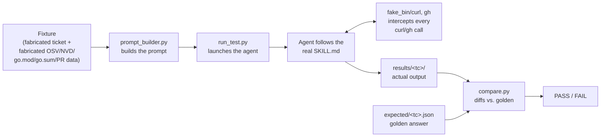

# CVE Skill Regression Tests

Regression test suite for [`skills/fix-cve-pr/SKILL.md`](../SKILL.md) — the
agent playbook used to triage CVE tickets, decide a disposition (`NEEDS_FIX`,
`ALREADY_FIXED`, `FALSE_POSITIVE`, etc.), and write up the resolution.

See [ACM-42634](https://redhat.atlassian.net/browse/ACM-42634).

## How it works

`SKILL.md` is a natural-language playbook, not code, so it can't be unit
tested directly. Instead, each test case:

1. Fabricates a Jira ticket + fabricated "internet" responses (OSV, NVD,
   `go.mod`/`go.sum`, `gh pr list`/`view`/`diff`) that pin down exactly one
   scenario.
2. Runs a real agent against the real, unmodified `SKILL.md` with those
   fabricated inputs substituted for the live ones.
3. Diffs the agent's actual output against a hand-written golden answer.



`fake_bin/curl` and `fake_bin/gh` are put first on `PATH` for the duration of
a run: the skill shells out to real `curl`/`gh` as normal, and these scripts
transparently return the fixture's fabricated data instead of hitting the
real internet. Anything not covered by the active fixture is **BLOCKED**
loudly rather than silently falling through to live data.

Each test case runs as its own, fully isolated agent invocation — never
batched together — so one fixture's data can never leak into another
scenario, and a failure always points at exactly one case.

## Layout

```
tests/
├── fixtures/<test_case>/       Fabricated ticket + fabricated OSV/NVD/go.mod/
│                               go.sum/PR data for one scenario
├── expected/<test_case>.json   Hand-written golden answer for that scenario
├── harness/
│   ├── fake_bin/curl, gh       The fake-internet interception layer
│   ├── prompt_builder.py       Builds the prompt for a given fixture
│   ├── run_test.py             Launches the agent (--backend cursor_sdk or
│   │                           claude_cli) and saves its output
│   ├── run_all.sh              Runs every test case and prints a summary
│   └── compare.py              Diffs actual output vs. golden, prints PASS/FAIL
├── results/<test_case>/        Output from the last run of each test case
└── requirements.txt
```

## The 13 test cases

| # | Test case | Scenario | Expected disposition |
|---|---|---|---|
| 1 | `tc01_happy_path` | CVE real, library outdated, nobody fixing it yet | `NEEDS_FIX` |
| 2 | `tc02_skip_status_in_progress` | Jira `Status` already `In Progress` | `SKIP` |
| 3 | `tc03_skip_open_pr` | `Development` column shows a linked open PR | `SKIP` |
| 4 | `tc04_already_fixed_pre_ga` | Fix PR merged **before** GA publish date | `ALREADY_FIXED` |
| 5 | `tc05_fixed_by_pr_open_line` | Fix merged, but release line has no GA baseline yet | `FIXED_BY_PR` |
| 6 | `tc06_fixed_in_git_not_in_ga` | Fix merged **after** GA publish date | `FIXED_IN_GIT_NOT_IN_GA` (not `ALREADY_FIXED`) |
| 7 | `tc07_false_positive_never_used` | Module never in the dependency graph at all | `FALSE_POSITIVE` |
| 8 | `tc08_false_positive_version_line` | Module present & compiled, but the real flaw is a different major version line (containerd v1 vs v2) | `FALSE_POSITIVE` |
| 9 | `tc09_fixed_in_git_gobump_side_effect` | Module was compiled at GA, disappeared later as an unrelated Go-bump side effect | `FIXED_IN_GIT_NOT_IN_GA` (not `FALSE_POSITIVE`) |
| 10 | `tc10_manual_review_os_level` | CVE doesn't correspond to any Go module (OS/RPM-level) | `MANUAL_REVIEW` |
| 11 | `tc11_sibling_consistency` | Two Jira tickets, different components, same repo/branch/CVE, shared `go.mod` | Both tickets get the same status |
| 12 | `tc12_update_existing_pr` | A merged fix PR already exists for a sibling ticket's CVE, missing this ticket's key | Same status as sibling + PR title/body/comment updated |
| 13 | `tc13_conflicting_pr_at_phase2` | An unrelated open PR is found, at PR-creation time, to also touch `go.mod` | Presents stack/wait/independent choice |

Every fixture file has a `_comment` field explaining exactly what it
fabricates and why; every golden file in `expected/` explains what's being
checked.

## How to run it

```bash
# One-time setup per local clone (.venv is gitignored, not committed)
cd skills/fix-cve-pr/tests
python3 -m venv .venv
./.venv/bin/pip install -r requirements.txt
```

Run the whole suite:

```bash
export CURSOR_API_KEY=...   # only needed for --backend cursor_sdk
./harness/run_all.sh --backend claude_cli
```

Each test case makes a real agent call — a full run costs roughly $7-7.50
and takes ~20-25 minutes sequentially. Add `--parallel N` to run up to N
agent calls concurrently and cut wall-clock time (this does not reduce the
number of agent calls made, so it does not change the dollar cost):

```bash
./harness/run_all.sh --backend claude_cli --parallel 5
```

Run and debug a single test case:

```bash
./.venv/bin/python harness/run_test.py tc06_fixed_in_git_not_in_ga --backend claude_cli
./.venv/bin/python harness/compare.py tc06_fixed_in_git_not_in_ga
cat results/tc06_fixed_in_git_not_in_ga/agent_final_text.md   # full agent reasoning
```

`--backend` selects how the agent is launched — `claude_cli` shells out to
the Claude Code CLI (works with Anthropic-direct or Vertex-routed `claude`,
whatever is already authenticated in the shell); `cursor_sdk` uses the
[Cursor SDK](https://cursor.com/docs/sdk/python) and needs `CURSOR_API_KEY`
set as an environment variable. Neither backend needs any credential written
into a file — both are read from the environment at run time, the same way
as `ANTHROPIC_API_KEY`/`OPENAI_API_KEY`. `compare.py` never needs a
credential; it only reads already-written result files. Both backends have
been verified working end to end.
